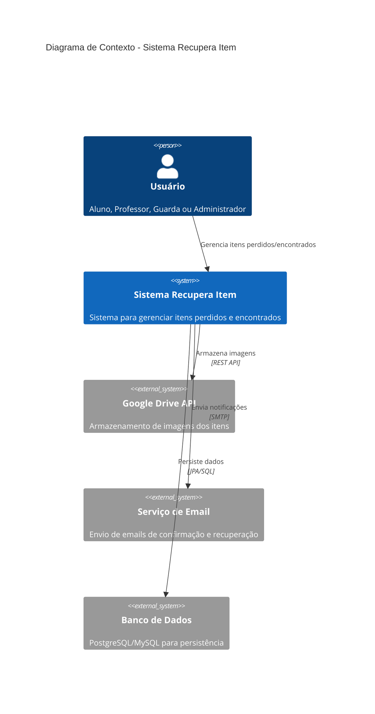
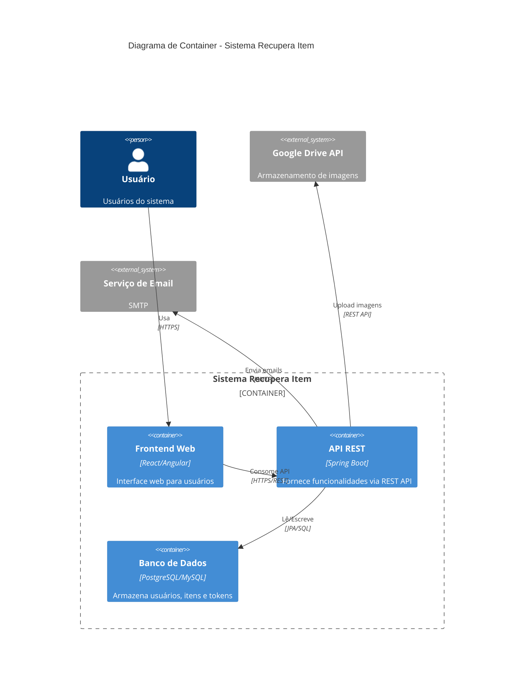
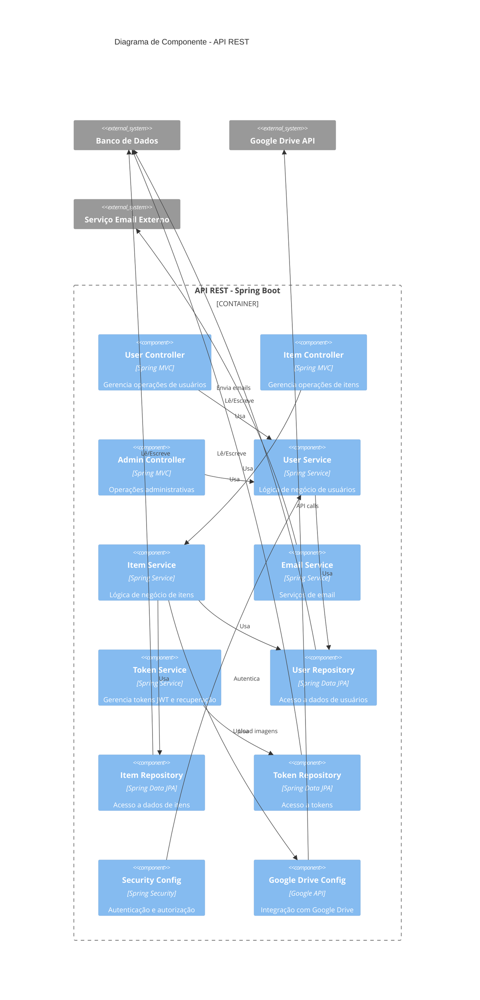

# Diagrama C4 - Sistema Recupera Item

## 1. Diagrama C4 - Nível de Contexto

## 2. Diagrama C4 - Nível de Container

## 3. Diagrama C4 - Nível de Componente

## Descrição do Diagrama C4

### Nível de Contexto
Mostra o sistema em alto nível e suas interações com usuários e sistemas externos:
- **Usuários**: Alunos, Professores, Guardas e Administradores
- **Sistemas Externos**: Google Drive, Serviço de Email, Banco de Dados

### Nível de Container
Detalha os principais componentes do sistema:
- **Frontend Web**: Interface do usuário
- **API REST**: Backend em Spring Boot
- **Banco de Dados**: Persistência de dados

### Nível de Componente
Mostra a estrutura interna da API REST:
- **Controllers**: Pontos de entrada da API
- **Services**: Lógica de negócio
- **Repositories**: Acesso a dados
- **Configurações**: Segurança e integrações externas

### Benefícios da Arquitetura:
- **Separação de responsabilidades**
- **Escalabilidade horizontal**
- **Facilidade de manutenção**
- **Integração com serviços externos**
- **Segurança robusta com JWT**
