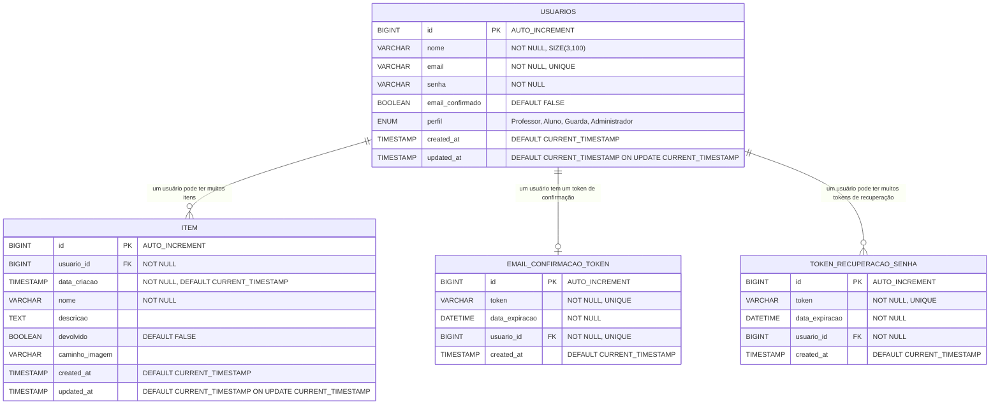

# Diagrama de Entidade-Relacionamento (ER) - Sistema Recupera Item

## Descrição das Entidades

### USUARIOS
**Tabela principal que armazena informações dos usuários do sistema**

| Campo | Tipo | Restrições | Descrição |
|-------|------|------------|-----------|
| id | BIGINT | PK, AUTO_INCREMENT | Identificador único do usuário |
| nome | VARCHAR(100) | NOT NULL, SIZE(3,100) | Nome completo do usuário |
| email | VARCHAR(255) | NOT NULL, UNIQUE | Email único para login |
| senha | VARCHAR(255) | NOT NULL | Senha criptografada (BCrypt) |
| email_confirmado | BOOLEAN | DEFAULT FALSE | Status de confirmação do email |
| perfil | ENUM | NOT NULL | Perfil: Professor, Aluno, Guarda, Administrador |
| created_at | TIMESTAMP | DEFAULT CURRENT_TIMESTAMP | Data de criação do registro |
| updated_at | TIMESTAMP | DEFAULT CURRENT_TIMESTAMP ON UPDATE | Data da última atualização |

**Índices:**
- PRIMARY KEY (id)
- UNIQUE INDEX (email)
- INDEX (perfil)

### ITEM
**Tabela que armazena informações dos itens perdidos/encontrados**

| Campo | Tipo | Restrições | Descrição |
|-------|------|------------|-----------|
| id | BIGINT | PK, AUTO_INCREMENT | Identificador único do item |
| usuario_id | BIGINT | FK, NOT NULL | Referência ao usuário responsável |
| data_criacao | TIMESTAMP | NOT NULL, DEFAULT CURRENT_TIMESTAMP | Data de cadastro do item |
| nome | VARCHAR(255) | NOT NULL | Nome/título do item |
| descricao | TEXT | NULLABLE | Descrição detalhada do item |
| devolvido | BOOLEAN | DEFAULT FALSE | Status de devolução |
| caminho_imagem | VARCHAR(500) | NULLABLE | URL da imagem no Google Drive |
| created_at | TIMESTAMP | DEFAULT CURRENT_TIMESTAMP | Data de criação do registro |
| updated_at | TIMESTAMP | DEFAULT CURRENT_TIMESTAMP ON UPDATE | Data da última atualização |

**Índices:**
- PRIMARY KEY (id)
- FOREIGN KEY (usuario_id) REFERENCES USUARIOS(id)
- INDEX (devolvido)
- INDEX (nome)
- INDEX (data_criacao)

### EMAIL_CONFIRMACAO_TOKEN
**Tabela para tokens de confirmação de email**

| Campo | Tipo | Restrições | Descrição |
|-------|------|------------|-----------|
| id | BIGINT | PK, AUTO_INCREMENT | Identificador único do token |
| token | VARCHAR(255) | NOT NULL, UNIQUE | Token UUID para confirmação |
| data_expiracao | DATETIME | NOT NULL | Data de expiração do token |
| usuario_id | BIGINT | FK, NOT NULL, UNIQUE | Referência ao usuário (um token por usuário) |
| created_at | TIMESTAMP | DEFAULT CURRENT_TIMESTAMP | Data de criação do token |

**Índices:**
- PRIMARY KEY (id)
- UNIQUE INDEX (token)
- UNIQUE FOREIGN KEY (usuario_id) REFERENCES USUARIOS(id)

### TOKEN_RECUPERACAO_SENHA
**Tabela para tokens de recuperação de senha**

| Campo | Tipo | Restrições | Descrição |
|-------|------|------------|-----------|
| id | BIGINT | PK, AUTO_INCREMENT | Identificador único do token |
| token | VARCHAR(255) | NOT NULL, UNIQUE | Token UUID para recuperação |
| data_expiracao | DATETIME | NOT NULL | Data de expiração do token |
| usuario_id | BIGINT | FK, NOT NULL | Referência ao usuário |
| created_at | TIMESTAMP | DEFAULT CURRENT_TIMESTAMP | Data de criação do token |

**Índices:**
- PRIMARY KEY (id)
- UNIQUE INDEX (token)
- FOREIGN KEY (usuario_id) REFERENCES USUARIOS(id)
- INDEX (data_expiracao)

## Relacionamentos

### USUARIOS → ITEM (1:N)
- **Cardinalidade**: Um usuário pode ter muitos itens
- **Chave Estrangeira**: item.usuario_id → usuarios.id
- **Regra de Integridade**: ON DELETE CASCADE (se usuário for deletado, seus itens também são deletados)
- **Regra de Negócio**: Apenas usuários com perfil Guarda, Professor ou Administrador podem cadastrar itens

### USUARIOS → EMAIL_CONFIRMACAO_TOKEN (1:1)
- **Cardinalidade**: Um usuário tem no máximo um token de confirmação ativo
- **Chave Estrangeira**: email_confirmacao_token.usuario_id → usuarios.id
- **Regra de Integridade**: ON DELETE CASCADE
- **Regra de Negócio**: Token expira em 24 horas

### USUARIOS → TOKEN_RECUPERACAO_SENHA (1:N)
- **Cardinalidade**: Um usuário pode ter múltiplos tokens de recuperação (histórico)
- **Chave Estrangeira**: token_recuperacao_senha.usuario_id → usuarios.id
- **Regra de Integridade**: ON DELETE CASCADE
- **Regra de Negócio**: Token expira em 1 hora, apenas o mais recente é válido

## Regras de Negócio do Banco

### Usuários
- Email deve ser único no sistema
- Senha deve ser armazenada criptografada (BCrypt)
- Perfil padrão para novos usuários: Aluno
- Email deve ser confirmado antes do primeiro login

### Itens
- Apenas usuários autorizados podem cadastrar itens (Guarda, Professor, Administrador)
- Item nasce com status devolvido = FALSE
- Caminho da imagem é opcional
- Data de criação é automaticamente definida

### Tokens
- Tokens de confirmação expiram em 24 horas
- Tokens de recuperação expiram em 1 hora
- Tokens são únicos no sistema
- Ao criar novo token, tokens antigos do mesmo tipo são invalidados

### Segurança
- Todas as senhas são criptografadas com BCrypt
- Tokens são gerados com UUID para evitar ataques de força bruta
- Timestamps automáticos para auditoria
- Chaves estrangeiras garantem integridade referencial
